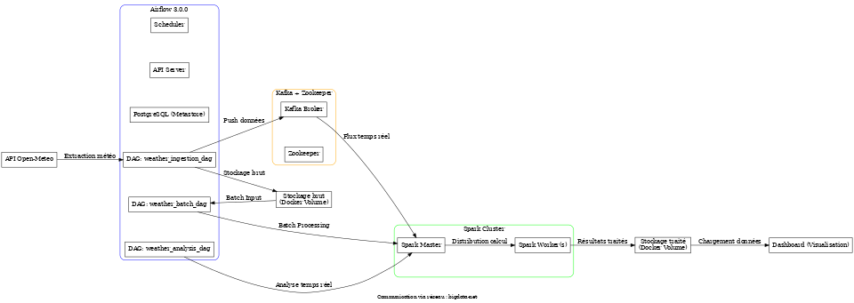

# Architecture du Système Big Data - Open-Meteo

Ce document décrit l'architecture complète du système Big Data pour le traitement des données météorologiques provenant de l'API Open-Meteo.

## Vue d'ensemble de l'Architecture

L'architecture est basée sur les principes d'une architecture Lambda, combinant:
- **Couche Speed** : Pour le traitement temps réel des données météorologiques
- **Couche Batch** : Pour le traitement de gros volumes de données historiques
- **Couche Serving** : Pour l'exposition des résultats via des API et des interfaces

## Évolutions majeures
- Mise à jour vers **Apache Airflow 3.0.0** avec Task Flow API
- Architecture en **conteneurs Docker séparés** pour meilleure isolation
- **Réseau partagé** pour la communication inter-services

## Composants clés

### 1. Ingestion des données

**API Open-Meteo → Kafka**

- **Source** : API Open-Meteo (https://api.open-meteo.com/v1/forecast)
- **Fréquence d'ingestion** : Horaire
- **Méthode** : Appels REST via scripts Python orchestrés par Airflow
- **Format de données** : JSON
- **Destination** : Topics Kafka
  - `weather-data` : Données brutes de l'API
  - `processed-weather` : Données après traitement
  - `weather-alerts` : Alertes détectées

### 2. Traitement des données

**Couche Batch**
- **Technologie** : Apache Spark
- **Type de traitement** : Jobs quotidiens et mensuels via `SparkSubmitOperator`
- **Stockage des résultats** : Volumes Docker partagés
- **Formats** : Parquet pour les analyses, CSV pour les exports

**Couche Speed**
- **Technologie** : Kafka Streams + Spark Streaming
- **Applications** : Détection d'alertes en temps réel
- **Latence** : < 5 secondes

### 3. Orchestration

**Apache Airflow 3.0.0**
- **Nouveautés** : Utilisation du Task Flow API avec décorateurs `@task`, `@dag`
- **DAGs** :
  - `weather_ingestion_dag.py` : Ingestion des données météo
  - `weather_batch_dag.py` : Traitement batch quotidien et mensuel
  - `weather_analysis_dag.py` : Analyse et visualisation des données avec API Task Flow
  - `weather_alerts_dag.py` : Surveillance des alertes météo

### 4. Stockage

**Volumes Docker**
- **Structure** :
  - `/data/raw` : Données brutes de l'API
  - `/data/processed` : Résultats du traitement Spark
  - `/data/output` : Résultats finaux prêts pour la visualisation

### 5. Visualisation

**Dashboard avec Filtrage de Données**
- **Interface utilisateur** : Dashboard Web
- **Fonctionnalités** :
  - Téléchargement des données (CSV/JSON)
  - Affichage tabulaire
  - Filtres dynamiques
  - Graphiques interactifs

## Flux de données

1. **Ingestion** : 
   - Les données sont extraites de l'API Open-Meteo toutes les heures
   - Les données sont stockées en format brut dans `/data/raw`
   - Les données sont publiées dans le topic Kafka `weather-data`

2. **Traitement temps réel** :
   - Spark Streaming traite les données du topic Kafka en temps réel
   - Des alertes sont générées pour les conditions météo extrêmes
   - Les alertes sont publiées dans `weather-alerts`

3. **Traitement batch** :
   - Airflow 3.0 orchestre des jobs Spark quotidiens
   - Les données sont agrégées par ville, région
   - Les résultats sont stockés en format Parquet dans `/data/processed`

4. **Exposition des données** :
   - Les résultats sont exposés via une API REST
   - Des tableaux de bord interactifs affichent les données

## Déploiement

L'architecture est déployée en deux stacks séparés mais connectés:

- **Stack Big Data** : `docker-compose.yml`
  - Kafka + Zookeeper
  - Spark Master + Worker

- **Stack Orchestration** : `docker-compose-airflow.yml`
  - Airflow 3.0.0 (Scheduler + API Server)
  - PostgreSQL (base de données Airflow)
  - LocalExecutor (adapté aux machines uniques)

### Communication inter-stack
- Réseau partagé `bigdata-net` pour permettre à Airflow de communiquer avec Kafka et Spark

## Connectivité entre services

- Kafka est accessible sur le port 9092
- Spark Master UI est accessible sur le port 8081 (port 8080 interne)
- Spark Worker UI est accessible sur le port 8082
- Airflow UI est accessible sur le port 8080

## Lancement de l'environnement

Pour démarrer l'environnement complet:

```bash
# Créer le réseau partagé (une seule fois)
docker network create bigdata-net

# Lancer les deux stacks
docker compose -f docker-compose-airflow.yml -f docker-compose.yml up -d
```

